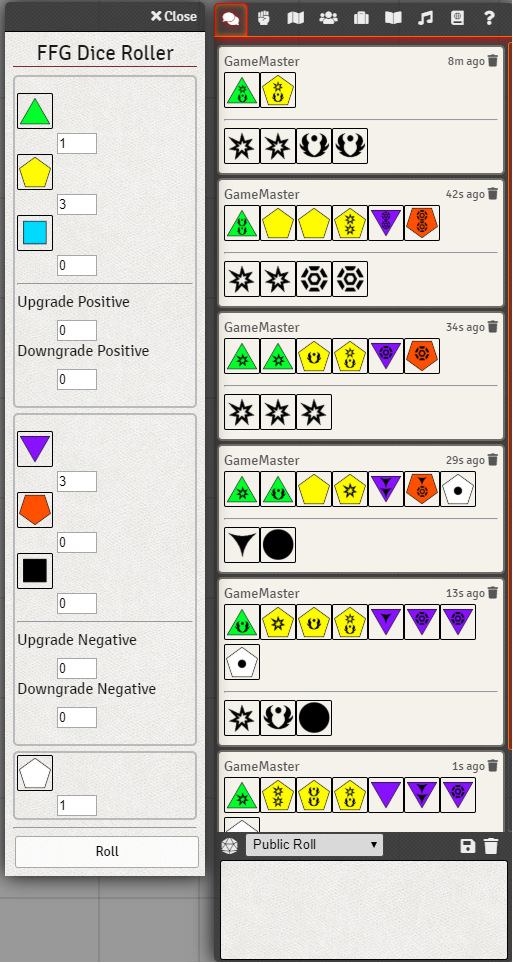

# FFG-Roller
A Foundry VTT module that adds a simple dice rolling window for Fantasy Flight Games RPGs

## Installation
1. Download the [ffg-roller.zip](https://github.com/ptasty/FFG-Roller/raw/master/ffg-roller.zip)
2. Unzip it into FoundryVTT/resources/app/public/modules
3. Restart Foundry if it was running.
4. Enable the module in the Module Configuration
5. The Button to launch the roller should appear in your settings tab.

## To Do
### Support Other Games
Currently the dice images used are based off the symbols for Star Wars RPG, I plan to add some of the other images as well as a way to select between them. They all work the same so if you're playing another game the symbols will be slightly different but will work. Currently I think the only other game that uses this die system is Genesys, or I could be wrong and that could change.

### Make It Pretty
I haven’t done much to make it pretty yet and will be improving the appearance.

### GM Altered Pools
Have the players pools check against the Gamemasters pool, so that the gamemaster can set up opposing dice for the roll.

### Expand Into A Game System Module
I would like to start working on a FFG SWRPG game system module at some point, starting with decent character sheets.

### License
 This work is licensed under a <a rel="license" href="http://creativecommons.org/licenses/by/4.0/">Creative Commons Attribution 4.0 International License</a>.

This work is licensed under Foundry Virtual Tabletop [EULA - Limited License Agreement for module development v 0.1.6](http://foundryvtt.com/pages/license.html).